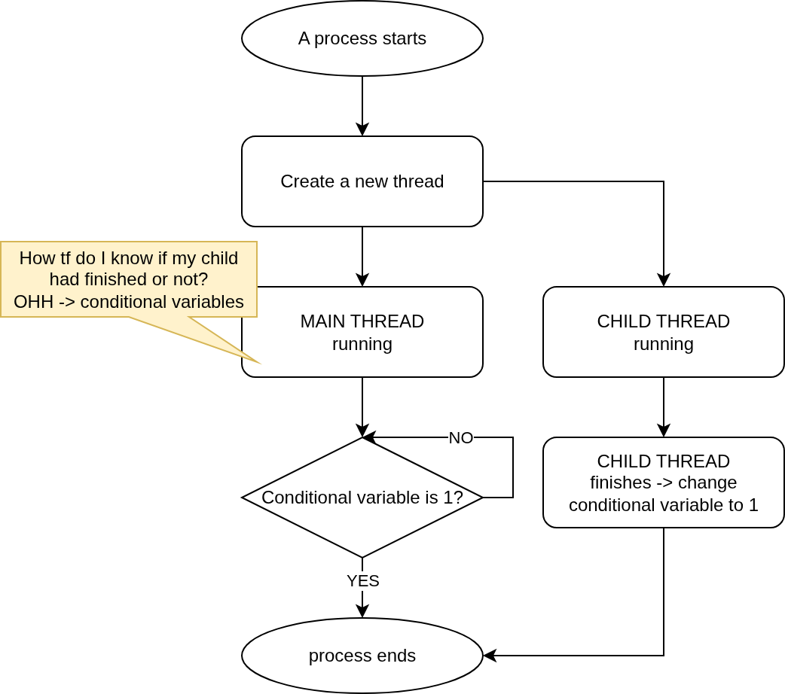

# xv6 Concurrency

This is a relatively easy problem in xv6 OS design, since the author of xv6 decides to go with `spinlock`. All you need to know is `spinlock` is implemented via x86 assembly `xchg` operation.

## Spinlock problem

This design is pretty simple and easy to understand, but it has some drawbacks

### Exhausted resources

If a process/thread wants to have the lock (which other process/thread is holding), it has to wait for that lock to be release

But that waiting activity actually consumes CPU cycle, which is not good

### No guaranteed lock acquisition

This is a hardware feature, if 2 or more CPUs call to `xchg` at the same time, only 1 random CPU gets to execute the operation.

So obviously, there will be threads that get the lock more than others. How do we ensure that every thread can use the lock equally ?

#### Ticket lock

Every thread has a number called `i`, the lock has a number `j`, every time a lock is taken, the `j` is increased. So a thread can only take a lock when the number `j` of the lock is the same with the number `i` that the thread is holding.

1. This lock ensures fairness, but it still does not solve the spinning problem
2. If you think about it, this lock is still fckn bad since the threads must wait for the "in turn" thread

## Conditional variables

Conditional variables provides a mechanism to solve the fork/join problem. This problem is described in the next sub-section

### Why bro ?

A primary benefit of using a condition variable is to avoid "spinning". Instead of wasting CPU cycles constantly checking if a condition is true, the wait() function puts the calling thread to sleep. The thread will only be woken up when another thread signals that the condition might have changed

### We also need a lock for complete implementation

To solve the "lost wakeup" problem, we also need a lock to make the
