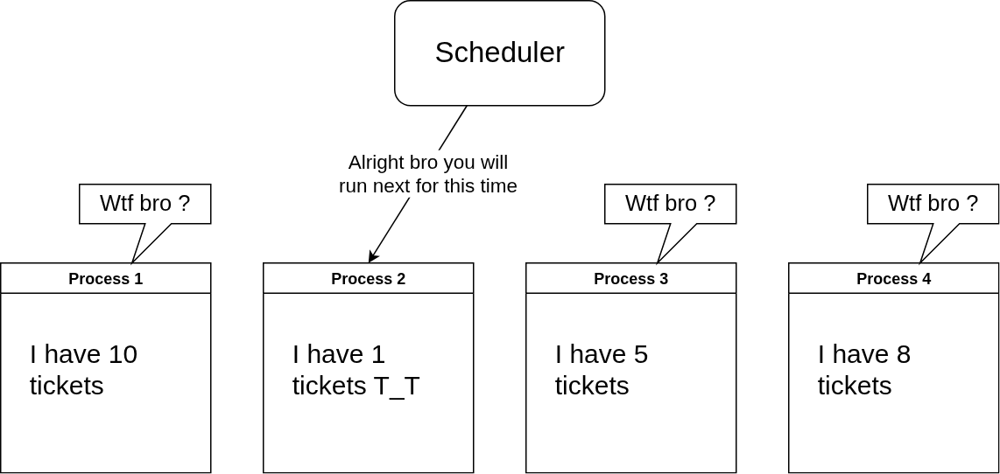
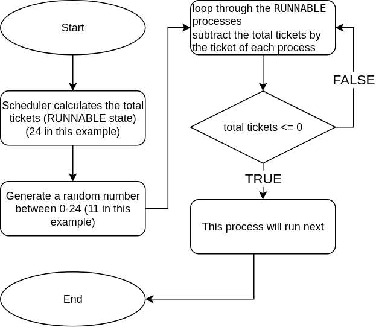
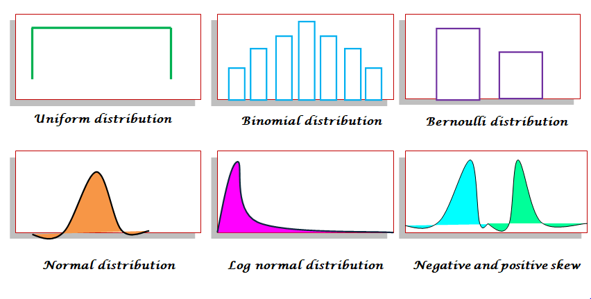

# xv6 Lottery Scheduler

We all know that the scheduler of xv6 is built on round-robin principle. There is a project to implement a new type of scheduler to xv6, called `Lottery Scheduler`

I have a few questions reading the description of [An xv6 Lottery Scheduler](https://github.com/remzi-arpacidusseau/ostep-projects/tree/master/scheduling-xv6-lottery) so I will make this repo as a detailed implementation of that project.

DISCLAIMER: You should read the description and have detailed knowlegde about system calls, scheduler, memory management of xv6 before doing this project.

## What is a "lottery scheduler" ?

Each time slice, a randomized lottery determines the winner of the lottery; that winning process is the one that runs for that time slice.

Note that, the winner can be any process, which makes sense if you think about it.


### So how does the number of tickets make a difference ?

Ofcourse, the number of tickets that a process has will increase the chances of running of that process, but not guarantee that the process will run.

To achieve that purpose, we will the algorithm described below (that's why the `Process 2` is the next to run in our example even though it only has 1 ticket)



### The random number generator must follow uniform distribution

The entire goal of a lottery scheduler is to make a process's chance of running directly proportional to the number of tickets it holds so if the random number generator does not follow the uniform distribution, the entire system will be broken



### The Linear Congruential Generator algorithm

An LCG generates a sequence of integers using the recurrence relation:

$$
X_{n+1}=(aX_n+c)mod m
$$

Where:

- $X_n$​ is the current random number (seed for next iteration)

- $a$ is the multiplier,

- $c$ is the increment,

- $m$ is the modulus,

- $X_0$​ is the initial seed.

This is the code for this random number generator

```c

static unsigned int rand_seed = 1;

// rand(): Returns the next pseudo-random number.
unsigned int
rand(void)
{
  // These constants are from "Numerical Recipes"
  // and are known to produce a good distribution.
  rand_seed = rand_seed * 1664525 + 1013904223;
  return rand_seed;
}

// rand_range(max): Returns a random number in the range [0, max-1].
int
rand_range(int max)
{
  if (max <= 0) {
    return 0;
  }
  // The modulo operator gives us a value within the desired range.
  return rand() % max;
}

```

## Added the information to the process table

Now, to track the tickets of each process and the time the process gets to run, we will have to modify the structure of elements in the process table

## Graph ?

Cover later since I have lunch now

## Anything else ?

Nah bro, this is relatively simple if you know the control of scheduler and system calls (which are covered before).

BUT IT IS NOT EASY FOR ME since insted of adding information to the process table (described above). I desgin a new object (yeah kind of, since C does not have the concept of object) which have the fields of `struct pstat` in `pstat.h`
