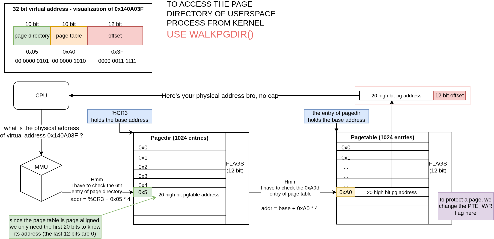

# xv6 Memory protection

Implementation of userspace memory page guard (READONLY) from the requirements of [this repo](https://github.com/remzi-arpacidusseau/ostep-projects/tree/master/vm-xv6-intro)

## Presequitives

You should have the brief understanding of how virtual memory works in xv6, which is covered in details in [the chapters about paging](github.com/palladian1/xv6-annotated) and [this repo](https://github.com/zarif98sjs/xv6-memory-management-walkthrough).

Yeah I know, getting a basic understanding about virtual memory is extremely easy. But to actually set things up from the boot process and everything, nah that is pretty difficult to understand. In fact, i spend a lot of time reading the code for this topic in xv6 and I still 100% sure how everything works, but I think I made enough progess to do this project.

## Virtual address in a nutshell

Yeah, basically the Memory Management Unit will translate the userspace virtual address to physical address. In that process, it will look at the flags at every page directory (or page table) entry to decide if the memory access is valid or not.

To protect a page (which means stop all write operations) we need to modify the flag that is stored in a page table entry.

To do that, we need to know its (page table entry) physical address, ahh, we need to use `walkpgdir()` here.

Since this is a relatively easy project, there's not much to say. For better visualization about everything, see the image below.

