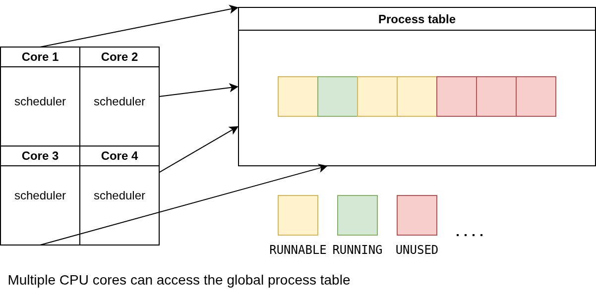
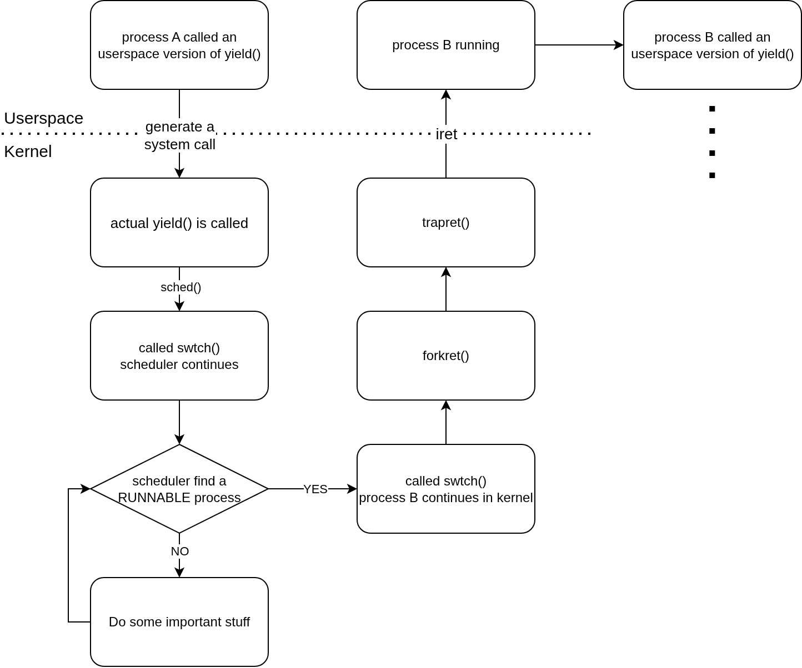
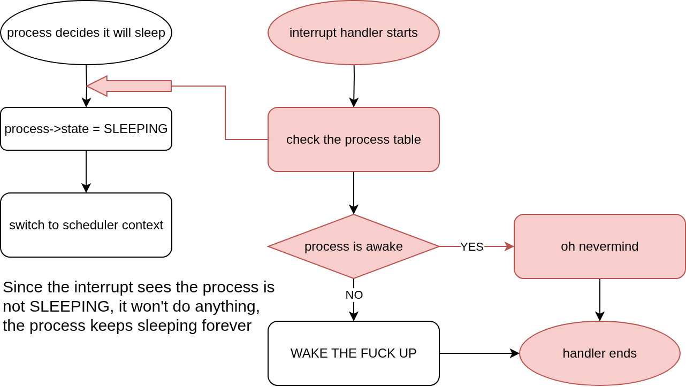

# xv6 Scheduling

The scheduler, as you all know, decides what process gets to run according to a pre-defined set of rules. In xv6, the "set of rules" is extremely simple and follow the round-robin fashion. Basically the scheduler iteratively checks the list of process, see if any process are runnable, and runs that process.

In a multi-core system, the process table is access by all the CPU cores, so we need a lock mechanism to protect this process table, covered in detail [here](https://github.com/palladian1/xv6-annotated/blob/main/scheduling.md#procc)

## The Context Switch: swtch.S

Every context switch from a process to another process is simply descibed in the flowchart below

### What does exactly swtch.S do ?

The swtch() function is a low-level assembly routine that performs the mechanical swap between two kernel threads (e.g., the scheduler and a process). It is not the entire scheduler itself.

### How does exactly swtch.S do that ?

1. Saves a minimal set of callee-saved registers and the instruction pointer (saved by the call instruction to `swtch()`) onto the current process's kernel stack. All these information put into the stack called `context`. This helps the process to work normally when it continues later on.

2. Saves the destination of old `context`. This helps the process the to get the information needed to continue later on.

3. Switches to the new process kernel stack, retreives the information (which is the new `context`) from the stack.

### Okay, but what about the events before swtch.S ?

When a user program wants to stop (giving the CPU to other process) it makes a system call, which basically generates an interrupt. The CPU hardware automatically handles the transition to kernel mode. This involves:

1. Saving User State: The CPU saves the user's instruction pointer (%eip) and stack pointer (%esp).

2. Loading Kernel State: It loads the kernel's stack and sets the instruction pointer to the address of the kernel's trap handler (and other thing as well, see the system call chapter)

### We returns to userspace now

Covered [here](https://github.com/palladian1/xv6-annotated/blob/main/scheduling.md#forkret)

## The Process Table Lock (ptable.lock)

### But wait, why tf do we need a lock ?

The ptable.lock is a global lock that protects the shared process table (ptable) from being accessed by multiple CPUs at the same time.

It prevents race conditions where two schedulers on different CPUs might try to run the same RUNNABLE process, which would corrupt its state and crash the system.

Even if we run this OS on 1 CPU, if we don't have a lock, an interrupt (from disk, I/O, the universe) can alter the state of the process table when we switch to other process, which is dangerous.

TL;DR: The lock ensures that operations like finding a process, changing its state (e.g., from RUNNABLE to RUNNING), and switching to it are atomic (unbreakable).

### The Lock's Journey and System Concurrency

This was a common point of confusion so I will explain in details 3 key points to illustrate why we need to use locks

#### Lost Wakeup Problem:

The lock is essential when a process needs to block (e.g., set its state to SLEEPING). Holding the lock ensures that the check for a condition and the act of sleeping happen atomically. This prevents a "lost wakeup" problem, where an interrupt might try to wake the process in the tiny window after it decided to sleep but before it actually set its state. The problem is shown in the image below

#### Deadlock with Interrupts Problem:

The system avoids deadlocks with interrupt handlers by using a careful sequence in the scheduler's main loop:

1. Enable interrupts to gives interrputs handler a tiny time slot to jump in and do what ever it needs (e.g. to wake a process up)

2. After that, the process table lock is acquire the lock to actually switch the context atomically

#### The lock keeper problem

We see that, the scheduler acquires the lock to ensure its job of switching context happens atomically. In the new context (new process), it must release the lock

Why?, the simple answer is other CPUs and interrupts also needs to access the process table, if the new process does not release the lock things may not go bad instantly, but eventually the whole system will stop working.

Because the lock is released almost instantly, the critical section is very short. This allows other CPUs that were waiting for the lock to acquire it quickly and schedule other processes, ensuring the multi-core system remains efficient and concurrent.
