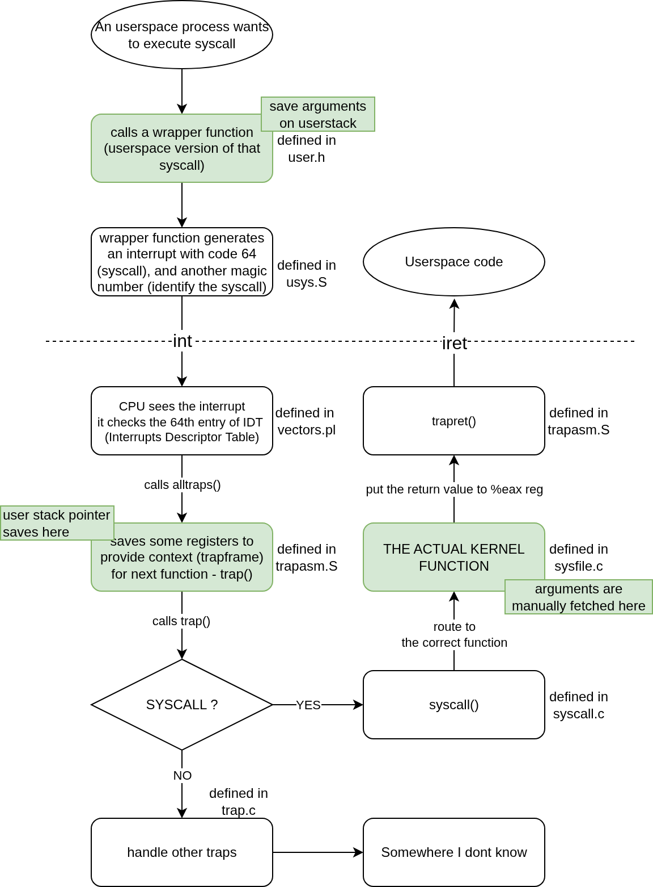

# xv6 System calls

Since the kernel code has the privilege to do stuff, when user processes wants to do stuff, it will transfer to kernel code by system calls

This flowchart shows what happens during a systemcall

## Fetching arguments from user stack

When a user program makes a system call, its arguments are already on its stack. The kernel finds them using the user's stack pointer (%esp), which was saved in the process's trap frame when the interrupt occurred.

### Find arguments address on the stack

To fetch the arguments, we must know where they are on the stack, but we only have the stack pointer. Ofcourse, we can manually add the desired number of bytes to get the arguments' addresses. But that would be very tedious and hard for anyone else reading our code

The `argint(n, *ip)` function is the primary tool for this. It calculates the memory address of the n-th integer argument using the saved stack pointer. The formula used is essentially:

Argument Address = `(saved_esp) + 4 + (n * 4)`

- `saved_esp`: The user's stack pointer at the time of the call.

- `4`: Skips over the return address that was pushed onto the stack by the function call.

- `n * 4`: Finds the desired argument, as each argument takes up 4 bytes.

The below figure illustrates why do we have that formula (of course, we are on 32bit machine)

### Fetching Different Data Types

1. Integers `fetchint()`: Takes a memory address provided by `argint()`, verifies it's a valid user address, and then copies the 4-byte integer from that location into a kernel variable.

2. Pointers `argptr()`: Uses `argint()` to get the address value of the pointer. It then performs additional checks to ensure the memory region the pointer points to is also valid and within the user's address space.

3. Strings (`argstr()` and `fetchstr()`): This is a two-step process.

   - `argstr()` first calls argint to get the address of the string (i.e., the pointer to its first character).

   - `fetchstr()` then takes that address and carefully scans byte-by-byte through user memory, ensuring the entire string is null-terminated and does not go beyond the process's allocated memory boundary.

## References

You need to understand the memory layout of xv6 in order to understand the address checking flow of `argint()`and other functions.

I noticed LLMs are making WRONG assumptions about xv6 memory layout and I thought that's the correct memory layout too. BUT TURNS OUT IT IS NOT, the misconception in xv6 memory layout takes me 4 hours questioning about the logic of address checking in those function.

Thanks to [this repo](https://github.com/zarif98sjs/xv6-memory-management-walkthrough) for providing the correct one

