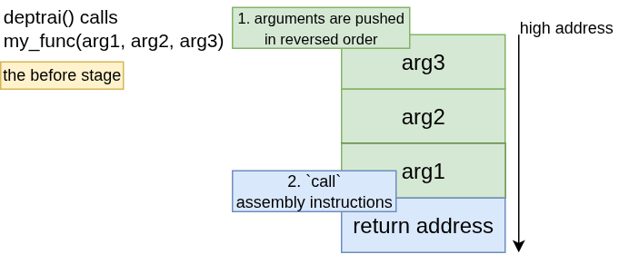
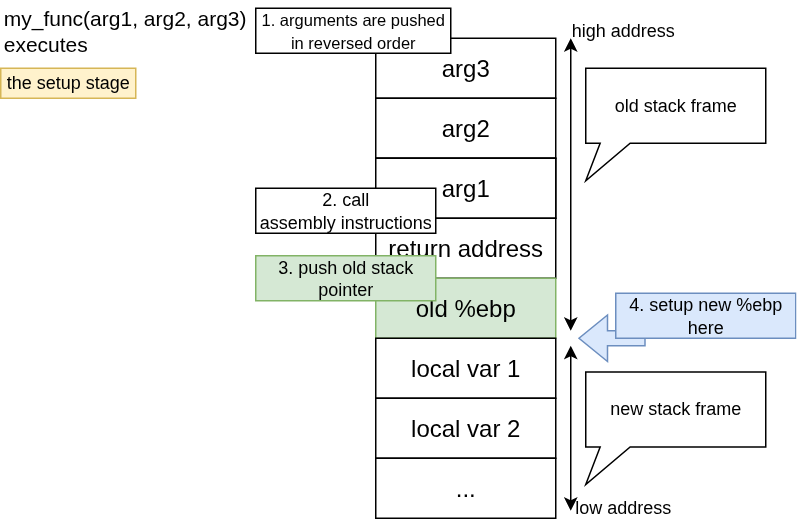
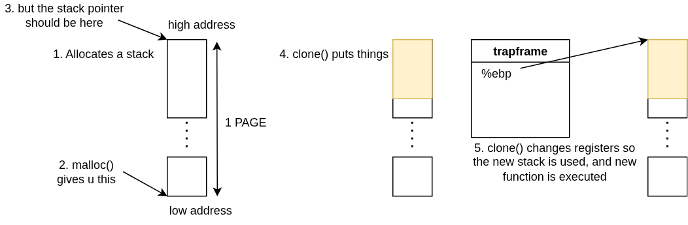

# xv6 Threads

## Thread and Process ?

The main difference between thread and process is threads share the same virtual address space. I think the main idea behind thread is to help reduce overhead of working with shared data.

## x86 calling convention

When a function is called, several things will happen as follow

### 1. The stack will be filled with arguments & return address

When a function `deptrai()` calls a new function `my_func()`, the arguments will be pushed on the stack in the reverse order, after that, the return address is also pushed on the stack

### 2. The new function will do some stuff before it actually starts

1. The new function pushes the stack base pointer on the stack (for returning to the old function when the new function finishes)

2. It fetches the arguments from the stack (arg1,arg2,arg3), we don't need to manually do this in C code, the compiler does that for us

3. Finally, it changes the base stack pointer to the stack pointer, making the new stack frame

### 3. Why do I have to know this calling convention ?

Yeah, since the new thread will **USE A DIFFERENT STACK**, so we need to manually construct a new stack, so that the new function executed in the new thread can actually fetches the arguments and does it jobs normally.

## How do we create a new thread in xv6 ?

Yeah the guide from this project tells me to read the `fork()` system call to make `clone()`. So we have these steps

This system call has to do several things as

1. Allocates a slot in the process table (same as `fork()`)
2. Creating a kernel stack (same as `fork()`)

But wait, after these 2 steps, `fork()` actually makes a new page directory (which contains the same virtual address space but different mappings to physical memory). After that, `fork()` makes the new process use this newly created page directory

In our case, we want the child thread to have the same address space as the old thread. So we don't create shit here

3. Allocates spaces (1 page) for a new stack (basically done by `malloc()` in the userland)

4. Manually adds stuff to the stack so the function in the new thread can execute normally (yeah here's the `clone()` jobs)

### `clone()`

This system call has the main job of allocating a stack and make it right so the function which is called in the new thread can executed normally

simple as that !

### `wait()`

So what happens after the function in the new thread had finished executing. I think the main thread should clean the resources right ?

1. Search for the right **"process"**, which is the slot in the process table that the thread is currently holding
2. Once we find that, we should save the location of the user stack (so we can `free()` it later on)
3. Clean kernel resources (kernel stack and mark the slot which is occupied the thread in the process table **UNUSED**)

Yeah, it is not hard at all, but i really have bad experience doing this project of adding these 2 system calls
